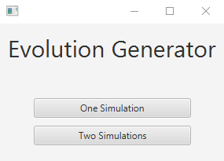
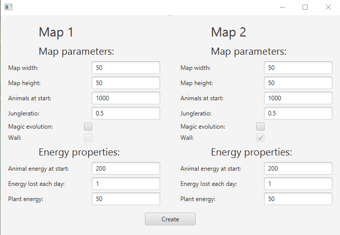

# EvolutionGenerator
Object-Oriented programming course at AGH UST.

# Versions:
javafx = 17

# Summary:
## Description:
The simulation is a project in java destined to get familiar with object-oriented
programming paradigm.
In simulation live creatures that roam, eat, reproduce and starve to death.
The simulation can be set beforehand with initial parameters.

In main menu we could choose one or two simulations: 

Initial settings:

Simulation view:

